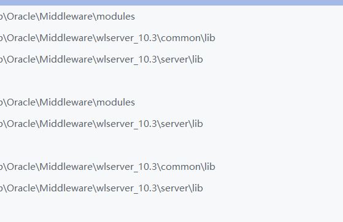
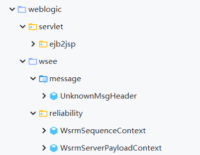
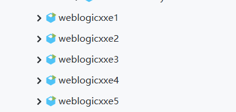

# weblogic xxe poc

#### 主要包含：

* CVE-2019-2647

* CVE-2019-2648

* CVE-2019-2649

* CVE-2019-2650

* CVE-2019-2888  

#### tips：

使用poc进行测试前，请先将以下jar包添加到项目的依赖中：

如下图所示，为需要覆盖的目标类文件的目录结构

 

分别运行以下poc即可生成序列化的xxe payload文件(注:poc只验证存在xxe)：

本地起http server挂载外部dtd文件，利用weblogic_t3.py脚本直接打即可：

